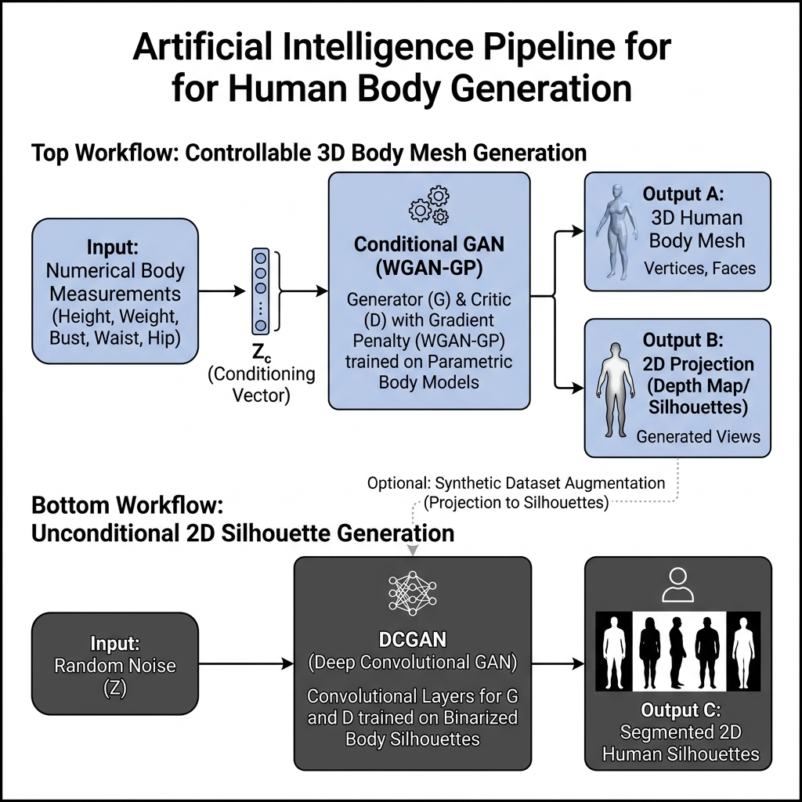
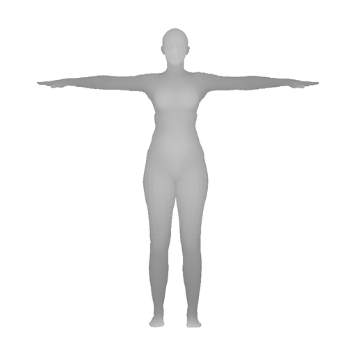
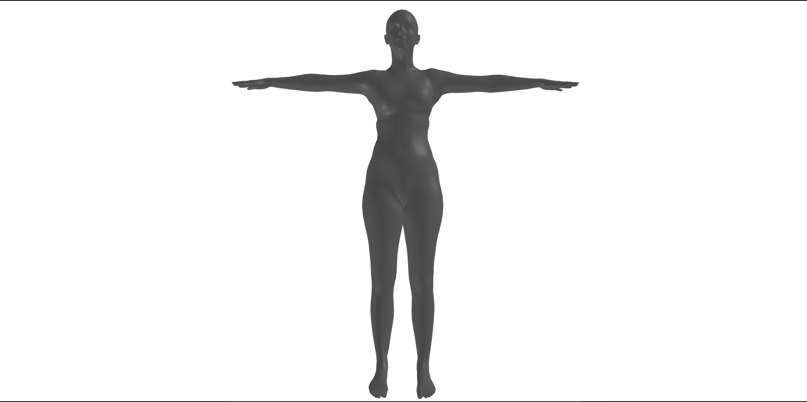
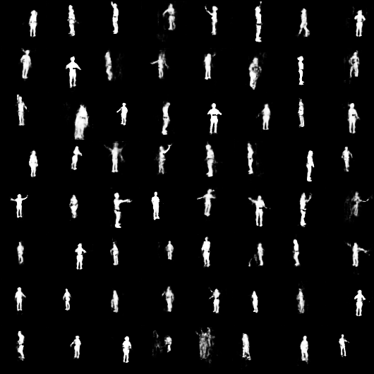

# GAN Body Lab


Proyecto de redes neuronales para generar cuerpos humanos a partir de datos
antropométricos mínimos. El repositorio combina un pipeline tabular condicionado
por medidas corporales con una rama independiente de generación de imágenes.

> **Idea central:** introducir 10 medidas corporales, generar una forma SMPL
> plausible y exportarla como imagen 2D, malla 3D o ambas.

---

## Vista rápida

| Pipeline | Entrada | Modelo | Salida |
| --- | --- | --- | --- |
| Tabular a cuerpo | 10 medidas corporales | WGAN-GP condicional + SMPL | `betas` SMPL, PNG 2D, OBJ 3D |
| Imagen TNT15 | Ruido latente | DCGAN + WGAN-GP | Imágenes humanas segmentadas |
| Evaluación | Dataset de test | SMPL measurements | MAE por medida |

<p align="center">
  
</p>


---

## Qué hace este proyecto

El sistema principal aprende una correspondencia generativa entre medidas
antropométricas y parámetros de forma SMPL:

```text
10 medidas + ruido z
        |
        v
Generador tabular condicional
        |
        v
10 betas SMPL
        |
        +--> Render 2D PNG
        +--> Malla 3D OBJ
```

Las 10 medidas usadas son:

| Campo | Significado |
| --- | --- |
| `Head_Top_Height` | Altura aproximada |
| `BUST_Circ` | Contorno de pecho |
| `NaturalWAIST_Circ` | Contorno de cintura |
| `HIP_Circ` | Contorno de cadera |
| `NeckBase_Circ` | Contorno de cuello |
| `Shoulder_to_Shoulder` | Anchura de hombros |
| `Inseam` | Tiro interior |
| `Outseam` | Largo exterior |
| `Thigh_Circ` | Contorno de muslo |
| `Bicep_Circ` | Contorno de bíceps |

La rama tabular no genera directamente píxeles. Primero genera `betas` de SMPL y
después esos `betas` se convierten en una geometría corporal que puede
proyectarse a 2D o exportarse como 3D.

---

## Resultados esperados

### Salida 2D

```powershell
python main.py infer --output image --view front
```

Genera un PNG en:

```text
internal/temp/generated_FEMALE_170_front.png
```

<p align="center">
  
</p>


### Salida 3D

```powershell
python main.py infer --output mesh
```

Genera un OBJ en:

```text
internal/temp/generated_FEMALE_170.obj
```

<p align="center">
  
</p>


### GAN de imágenes TNT15

```powershell
python main.py infer_img -n 64 --grid
```

Genera un grid de imágenes en:

```text
internal/temp/generated_grid_64.png
```

<p align="center">
  
</p>


---

## Instalación

### 1. Crear y activar entorno virtual

En Windows PowerShell:

```powershell
python -m venv venv
.\venv\Scripts\activate
```

### 2. Instalar dependencias

```powershell
pip install -r requirements.txt
```

El proyecto usa PyTorch con CUDA 12.1 según `requirements.txt`. Si se va a usar
CPU o una versión distinta de CUDA, puede ser necesario adaptar las líneas de
`torch`, `torchvision` y `torchaudio`.

---

## Datos necesarios

Los datos no se versionan en Git porque `internal/` está ignorado. La estructura
esperada es:

```text
internal/
  data/
    nomo3d/
      female_meas_txt/
      male_meas_txt/
    smpl/
      SMPL_FEMALE.pkl
      SMPL_MALE.pkl
      SMPL_NEUTRAL.pkl
    tnt15/
      Images/
        mr/
        pz/
        sg/
        sp/
```

### NOMO3D

Se usa en la rama tabular. Cada fichero `.txt` contiene medidas corporales que
se leen desde `src/data/dataset.py`.

### SMPL

Se usa para convertir los `betas` generados en una malla corporal. Sin los
modelos SMPL, `fit`, `eval` e `infer` no pueden construir cuerpos.

### TNT15

Se usa solo en la rama de imagen. La ruta se resuelve así:

1. Variable de entorno `TNT15_ROOT`, si existe.
2. Ruta por defecto `internal/data/tnt15/`.

Ejemplo:

```powershell
$env:TNT15_ROOT="D:\datasets\TNT15_V1_0"
python main.py train_img
```

---

## Uso principal

### Preparar pseudo-ground-truth de betas

```powershell
python main.py fit
```

Este paso ajusta `betas` SMPL para cada muestra de NOMO3D mediante
Gauss-Newton y los guarda en:

```text
internal/data/betas_cache/
```

También registra estadísticas en:

```text
internal/logs/beta_fit_stats.csv
```

### Entrenar el GAN tabular

```powershell
python main.py train
```

Entrena una WGAN-GP condicional:

```text
Generador:     z + 10 medidas normalizadas -> 10 betas SMPL
Discriminador: 10 betas + 10 medidas       -> score Wasserstein
```

Los checkpoints se guardan como:

```text
internal/experiments/wgangp_ckpt_*.pt
```

### Inferencia tabular

```powershell
python main.py infer
```

Por defecto genera una imagen 2D frontal. Para controlar la salida:

| Comando | Resultado |
| --- | --- |
| `python main.py infer --output image` | Solo PNG 2D |
| `python main.py infer --output mesh` | Solo OBJ 3D |
| `python main.py infer --output both` | PNG 2D + OBJ 3D |
| `python main.py infer --view front` | Vista frontal |
| `python main.py infer --view side` | Vista lateral |
| `python main.py infer --view back` | Vista trasera |
| `python main.py infer --wireframe` | PNG con aristas visibles |

Ejemplo con medidas personalizadas:

```powershell
python main.py infer `
  --gender FEMALE `
  --height 170 `
  --bust 90 `
  --waist 70 `
  --hip 95 `
  --neck 34 `
  --shoulder 40 `
  --inseam 80 `
  --outseam 100 `
  --thigh 55 `
  --bicep 28 `
  --output both
```

### Evaluar el modelo tabular

```powershell
python main.py eval
```

Carga el último checkpoint tabular, genera cuerpos para el split de test y
calcula MAE en centímetros para las medidas que puede mapear a SMPL.

---

## Rama de imágenes TNT15

Esta rama es independiente de la rama tabular. No usa medidas corporales: aprende
la distribución visual de imágenes humanas segmentadas.

```text
ruido z -> ImgGenerator -> imagen 64x64 en escala de grises
```

### Entrenar

```powershell
python main.py train_img
```

Guarda checkpoints como:

```text
internal/experiments/wgangp_img_ckpt_*.pt
```

Y grids de seguimiento en:

```text
internal/logs/img_samples/sample_epoch_*.png
```

### Generar imágenes

```powershell
python main.py infer_img -n 16
python main.py infer_img -n 64 --grid
```

Las imágenes se guardan en:

```text
internal/temp/
```

---

## Arquitectura

### WGAN-GP tabular

| Componente | Implementación | Detalle |
| --- | --- | --- |
| Generador | `src/models/generator.py` | MLP condicional con bloque residual |
| Discriminador | `src/models/discriminator.py` | MLP sin sigmoid final |
| Trainer | `src/train.py` | WGAN-GP con `n_critic=5` |
| Dataset | `src/data/dataset.py` | Lee medidas NOMO3D y betas cacheadas |
| Fitter | `src/data/beta_fitter.py` | Ajusta betas con Gauss-Newton |
| Render 2D | `src/render_2d.py` | Proyección ortográfica a PNG |

### WGAN-GP de imagen

| Componente | Implementación | Detalle |
| --- | --- | --- |
| Generador | `src/models/img_generator.py` | DCGAN con `ConvTranspose2d` |
| Discriminador | `src/models/img_discriminator.py` | CNN con `GroupNorm` |
| Trainer | `src/train_img.py` | WGAN-GP sobre imágenes TNT15 |
| Dataset | `src/data/img_dataset.py` | PNGs segmentados, grayscale, 64x64 |
| Inferencia | `src/inference_img.py` | Muestras sueltas o grid |

---

## Estructura del repositorio

```text
.
├── main.py                  # CLI principal del proyecto
├── requirements.txt         # Dependencias
├── src/
│   ├── config/              # Rutas e hiperparámetros
│   ├── data/                # Datasets y ajuste de betas
│   ├── models/              # Generadores y discriminadores
│   ├── smpl_module_project/ # Medición, landmarks y visualización SMPL
│   ├── train.py             # Entrenamiento WGAN-GP tabular
│   ├── inference.py         # Inferencia tabular a 2D/3D
│   ├── train_img.py         # Entrenamiento WGAN-GP de imagen
│   └── inference_img.py     # Inferencia de imagen
├── docs/                    # Memoria, notas y capturas para README
├── laTex/                   # Memoria final en LaTeX
├── notebooks/               # Exploración y análisis
└── internal/                # Datos, checkpoints, logs y salidas locales
```

---

## Salidas y checkpoints

| Ruta | Contenido |
| --- | --- |
| `internal/experiments/wgangp_ckpt_*.pt` | Checkpoints del GAN tabular |
| `internal/experiments/wgangp_img_ckpt_*.pt` | Checkpoints del GAN de imagen |
| `internal/experiments/meas_scaler.npz` | Media y desviación de medidas |
| `internal/data/betas_cache/*.npy` | Betas ajustados para NOMO3D |
| `internal/logs/beta_samples.csv` | Evolución de betas de prueba |
| `internal/logs/img_samples/*.png` | Muestras del GAN de imagen por epoch |
| `internal/temp/*.png` | Imágenes generadas |
| `internal/temp/*.obj` | Mallas 3D generadas |

---

## Problemas frecuentes

### `No checkpoints found. Please train first.`

Falta entrenar el modelo tabular:

```powershell
python main.py fit
python main.py train
python main.py infer
```

### `TNT15 images dir not found`

Falta colocar TNT15 en `internal/data/tnt15/Images` o definir `TNT15_ROOT`.

### Warnings de SMPL, NumPy o `chumpy`

El proyecto incluye parches de compatibilidad en `main.py` para versiones
modernas de Python y NumPy. Algunos warnings pueden aparecer, pero no implican
necesariamente que la inferencia haya fallado.

### La salida 2D se ve simple

El render 2D actual es un proyector ligero sin motor gráfico 3D. Está pensado
para funcionar sin OpenGL ni ventana. Para resultados más realistas se podría
añadir un renderizador con cámara, luces y material.

---

## Estado del proyecto

- Pipeline tabular completo: `fit -> train -> eval -> infer`.
- Inferencia tabular con salida 2D, 3D o ambas.
- Pipeline de imagen TNT15 independiente: `train_img -> infer_img`.
- Documentación técnica ampliada en `docs/memoria.md`.
- Memoria académica en `laTex/`.

---

## Comandos resumen

```powershell
# Preparar datos tabulares
python main.py fit

# Entrenar GAN tabular
python main.py train

# Evaluar GAN tabular
python main.py eval

# Generar imagen 2D desde medidas
python main.py infer --output image

# Generar malla 3D desde medidas
python main.py infer --output mesh

# Generar ambas salidas
python main.py infer --output both

# Entrenar GAN de imágenes
python main.py train_img

# Generar grid de imágenes
python main.py infer_img -n 64 --grid
```

